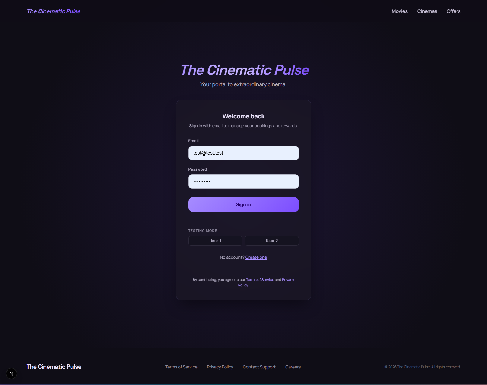

# cinema-app

Monorepo for a **cinema seat booking** web app: session listings, hall selection, seat picking, and reservations.

## Screenshots

**Sign in** — email/password form and testing-mode shortcuts for seeded dev users.



**Booking** — movie, hall, date and time, interactive seat map, checkout.


## How it works

| Layer | Stack |
|-------|--------|
| **Frontend** | Next.js (App Router), React, SCSS, Zustand |
| **Backend** | NestJS, Prisma, PostgreSQL |
| **API** | REST; CORS with `credentials` for cookies |

**User flow:** sign up or sign in → browse sessions by date and hall → choose seats → create and confirm bookings (protected routes require authentication).

**Auth (summary):**

- **Access token** (JWT) — short-lived, kept **in memory** on the client, sent as `Authorization: Bearer …`.
- **Refresh token** — **httpOnly** cookie on the API origin; the client can obtain a new access token on load and on 401 via `POST /auth/refresh`.
- Passwords hashed with bcrypt; login/register rate-limited.

**Data:** movies, halls, seat grids, sessions, reservations; the seed fills demo content and test users (see `apps/backend/prisma/seed.ts`).

## Requirements

- **Node.js** ≥ 20  
- **npm** (workspaces)  
- **Docker** and **Docker Compose** — for Postgres and/or the full containerized stack (optional for the hybrid workflow below)  
- **PostgreSQL 16** — if you are not using Compose, set your own `DATABASE_URL`

## Quick start

### Option A — Postgres in Docker, apps on the host (recommended)

Uses `apps/backend/docker.local.env` (Postgres at `127.0.0.1:5433`).

```bash
cp .env.example .env
npm install
npm run dev:all
```

Open http://localhost:3000 (frontend); API at http://localhost:4000.

### Option B — apps only (Postgres already running)

Ensure `DATABASE_URL` in your environment points at your database, then:

```bash
npm install
npm run db:prepare -w backend   # from repo root, with DATABASE_URL set
npm run db:seed -w backend      # seed loads docker.local.env via the backend script
npm run dev
```

If the database is not on `127.0.0.1:5433`, set `DATABASE_URL` in your shell or `apps/backend/.env` and run `prisma migrate deploy` / `prisma db seed` from `apps/backend` manually.

### Option C — full stack in Docker

```bash
docker compose up --build -d --wait
```

See `docker-compose.yml`; frontend :3000, backend :4000.

Clean rebuild with empty volumes:

```bash
npm run docker:stack:fresh
```

## Commands (repository root)

| Command | Purpose |
|---------|---------|
| `npm run dev` | Frontend + backend on the host (ports 3000 / 4000); frees those ports first |
| `npm run dev:all` | Start Postgres (`compose`), migrations + seed with `docker.local.env`, then `dev` with the same env |
| `npm run dev:all:db` | Migrations and seed only (Postgres must already be reachable) |
| `npm run dev:all:app` | Apps only with `docker.local.env` |
| `npm run build` | Build every workspace that defines `build` |
| `npm run lint` | Lint / typecheck across workspaces |
| `npm run db:seed` | Database seed (backend `db:seed` with `docker.local.env`) |

**Docker (wrappers around `docker compose`):**

| Command | Purpose |
|---------|---------|
| `npm run docker:stack` | Up with build, detached, wait for health |
| `npm run docker:stack:fresh` | Down with volumes + up --build |
| `npm run docker:build` / `docker:build:nocache` | Build images |
| `npm run docker:up` / `docker:up:detached` / `docker:up:build` / `docker:up:build:detached` | Run compose |
| `npm run docker:down` | Stop and remove containers |
| `npm run docker:stop` | Stop only |
| `npm run docker:logs` | Follow logs |
| `npm run docker:ps` | Service status |
| `npm run docker:clean` | Down and remove volumes |
| `npm run docker:db:reset` | Down -v + Postgres only + wait |
| `npm run docker:infra:up` / `docker:infra:down` | `postgres` service only |

**`backend` workspace** (`npm run <script> -w backend`): `dev`, `build`, `start`, `db:prepare`, `db:seed`, `lint`, etc. — see `apps/backend/package.json`.

**`frontend` workspace**: `dev`, `build`, `start`, `lint` — see `apps/frontend/package.json`.

## Environment variables

Root **`.env.example`** — template for Compose and shared values (`POSTGRES_*`, `DATABASE_URL`, `JWT_*`).

For local Postgres on **host port 5433**, **`apps/backend/docker.local.env`** is used by `dev:all` and by the backend `db:seed` script.

More backend options: `apps/backend/env.example`.

## See also

- API usage: `docs/backend-user-scenarios.md`
- Architecture: `ARCHITECTURE.md`
- Re-seed with demo data reset: set `SEED_FORCE=true` and run `npm run db:seed -w backend` (destructive: clears reservations/sessions and more — see `seed.ts`)
